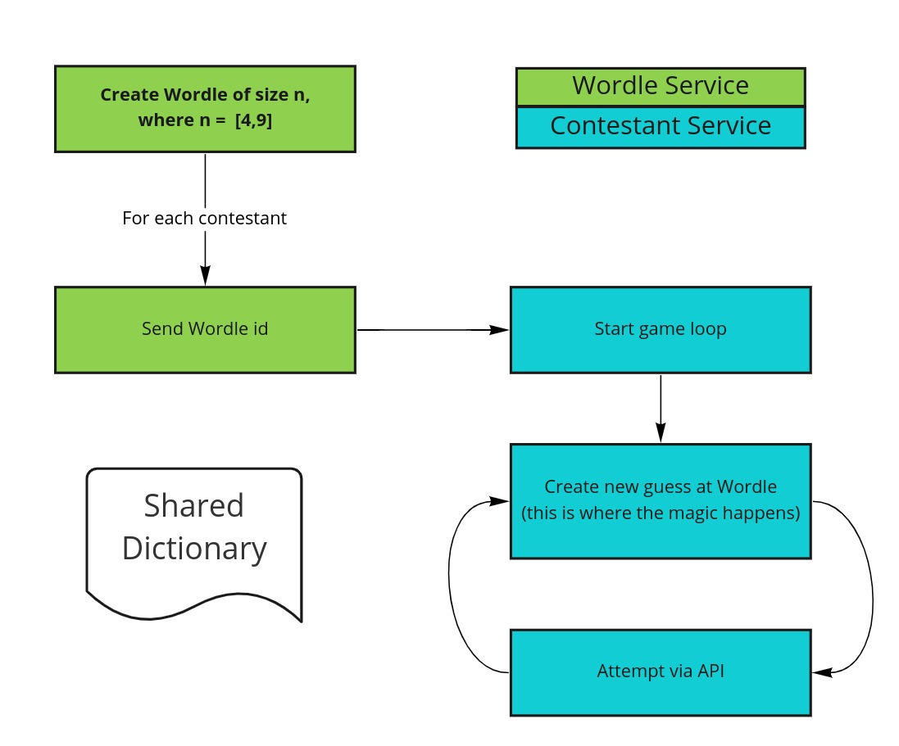

# Ramp Wordle

This is the contestant repo for the [Ramp Wordle Challenge](https://content.rampgrowth.com/wordle-challenge).

## How does the challenge work?

On `game day` (after submissions have closed) Ramp will generate several Wordles of varying length. These Wordles need to be solved by services hosted by contestants. Points are assigned based on how few attempts are made to solve the World. The contestant with the overall best score wins.

The image below illustrates the `game day` process.



* Ramp will create several Wordles of varying length between 4 and 9 letters long (inclusive). These Wordles are chosen at random from custom dictionaries hosted at S3 (see the file [config.py](/wordle_contestant/config.py) for the list dictionaries and their relevant S3 locations).
* The id for a Wordle will be sent to each contestant service's `/games` endpoint (hosted on heroku).
* Given the Wordle id the contestant service makes calls to the [Ramp World Service](https://ramp-wordle-server.herokuapp.com/) in order to try and solve the Wordle within the given time limit of 5 minutes.
* This process of Wordle generation and solving by contestants will repeat several times.

## How do I participate?

* Register via the Wordle challenge [page](https://content.rampgrowth.com/wordle-challenge).
* Fork this repo and implement the missing parts. This service already contains the basic code required in order to both receive and authorise a request to the `/games` endpoint. It is up to you to implement the necessary code so that a `POST` to the `/games` endpoint is able to determine a given World in as few attempts as possible.
* Host your solution on Heroku (you can use the free tier for this). Be sure to add your `heroku_app_url` via the Ramp Wordle Server endpoint `PUT /contestants/profile` before the submissions close (this allows us to make a call to your heroku service).
* Share your private repo with Ramp's GitLab user [RampDeveloper](https://gitlab.com/RampDeveloper) within 24 hours after the submission date has closed.
* See the T&Cs [here](https://content.rampgrowth.com/wordle-challenge/terms-and-conditions).
* GLHF!

## Setup

1. Clone git repository
    ```shell
    git clone git@gitlab.com:rampagency/wordle-contestant.git
    cd wordle-contestant
    ```

2. Create virtual environment and install requirements
    ```shell
    python3 -m venv wordle-contestant
    pip install -r requirements.txt
    ```

3. API key

    - Add the API key that you received upon registration to your environment variables:
    ```dotenv
    API_KEY=<YOUR_API_KEY>
    ```

4. Install Heroku

    Install: [Heroku Command Line Interface](https://devcenter.heroku.com/articles/heroku-cli#download-and-install)

    Verify installation:
    ```bash
    heroku --version
    ```
    
    Login to Heroku:
    ```bash
    heroku login
    ```
    
    Additional info:
    
    - [Install Heroku and deploy](https://devcenter.heroku.com/articles/git)
    
    - [Getting Started on Heroku with Python](https://devcenter.heroku.com/articles/getting-started-with-python#set-up)

## Run

Run locally on Heroku
```shell
heroku local
```

Deploy to Heroku (local `master` branch to Heroku's `main` branch)
```shell
git push heroku master:main
```
